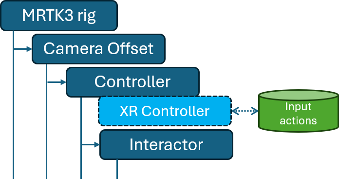

# MRTK3 XRI2 to XRI3 migration guide

## Introduction

Thank you for choosing MRTK as your Mixed Reality framework. MRTK has been upgraded to follow XRI3 patterns and consume [Unity's XR Interaction Toolkit 3+](https://docs.unity3d.com/Packages/com.unity.xr.interaction.toolkit@3.0/manual/whats-new-3.0.html) package. The upgrade encompasses various changes from the previous MRTK version and we want to share our experience during the upgrade so that the community is aware of the changes that had to be implemented. We also want to provide an overall roadmap for others to do their own upgrades in their forks or proprietary solutions and therefore we created this guide. We created this guide to empower you and your organization to achieve more in Mixed Reality solutions.

## Original MRTK rig structure

Previous to XRI3 upgrade the MRTK3 rig had a structure similar to the one shown in the next figure:

The MRTK3 rig prefab is the root GameObject with the Camera Offset ([XROrigin](https://docs.unity3d.com/Packages/com.unity.xr.core-utils@2.0/api/Unity.XR.CoreUtils.XROrigin.html)) child that has the multiple controllers (LeftHand, RightHand, and Gaze) as children. Next is a screenshot of the now obsolete MRTK XR Rig.

All of the Input Actions were centralized in the [XRController](https://docs.unity3d.com/Packages/com.unity.inputsystem@1.8/api/UnityEngine.InputSystem.XR.XRController.html) component at the controller level, for example:

The new, XRI3, MRTK rig + controllers have a slightly different structure which is shown next:

In essence, the main difference is that the [XRController](https://docs.unity3d.com/Packages/com.unity.inputsystem@1.8/api/UnityEngine.InputSystem.XR.XRController.html) component has been removed and replaced with a [Tracked Pose Driver](https://docs.unity3d.com/Packages/com.unity.inputsystem@1.8/api/UnityEngine.InputSystem.XR.TrackedPoseDriver.html) component which stores references to the Position, Rotation, and Tracking State actions (these can be and are the same as in the old structure). The other input actions (e.g. Select, Activate, UIPress, etc) are moved from the Controller to the Interactor. They are stored in fields already defined in the [Unity's XR Interaction Toolkit 3+](https://docs.unity3d.com/Packages/com.unity.xr.interaction.toolkit@3.0/manual/whats-new-3.0.html) package.

The XRI3 migration consisted of a set of steps to remove deprecated components and reference the existing Input Actions in their new homes. We recommend that the first step is to move the Position, Rotation and Tracking State actions to their new home according to the new [Unity's XR Interaction Toolkit 3+](https://docs.unity3d.com/Packages/com.unity.xr.interaction.toolkit@3.0/manual/whats-new-3.0.html).

## Step 1 - Move Position, Rotation, and Tracking State actions

Unity introduced a new [Tracked Pose Driver](https://docs.unity3d.com/Packages/com.unity.inputsystem@1.8/api/UnityEngine.InputSystem.XR.TrackedPoseDriver.html) component which is the new home for the Position, Rotation, and Tracking State input actions. Add such component (or a class derived from it) to your controller(s) and add references to the already existing Position, Rotation, and Tracking State actions that were referenced in the removed XRController, as shown the next figure:

## Step 2 - Implement your own Model functionality

The next step would be to implement your own controller Model functionality if you use it at all. Unity kindly shared that they have no plans to implement a new home for the Model functionality of the [XRController](https://docs.unity3d.com/Packages/com.unity.inputsystem@1.8/api/UnityEngine.InputSystem.XR.XRController.html) because of its simplicity so we had to implement it. Fortunately, they are correct and their implementation is quite easy, we recommend you to check MRTK's HandModel MonoBehaviour for an example of its implementation. The next figure shows the new home for the [XRController](https://docs.unity3d.com/Packages/com.unity.inputsystem@1.8/api/UnityEngine.InputSystem.XR.XRController.html) Model functionality in the new MRTK Controller:

### Input Compatibility Mode

As you make progress in upgrading your Controllers and Interactors to XRI3, it is a good idea to keep an eye on the deprecated XR Controller Configuration Input Compatibility Mode field. This mode controls whether the Interactor uses the new input readers or use the deprecated XR Controller component as per [Unity's changelog](https://docs.unity3d.com/Packages/com.unity.xr.interaction.toolkit@3.0/changelog/CHANGELOG.html#changed-3). It defaults to *Automatic*, however, **<u>this behavior may show false-positive correct behaviors</u>** if you have not removed the [XRController](https://docs.unity3d.com/Packages/com.unity.inputsystem@1.8/api/UnityEngine.InputSystem.XR.XRController.html) component from the Controller.

The Input Compatibility Mode can be found via Inspector under the *(Deprecated) XR Controller Configuration* group as shown here:

## Step 3 - Move the remaining [XRController](https://docs.unity3d.com/Packages/com.unity.inputsystem@1.8/api/UnityEngine.InputSystem.XR.XRController.html) input actions to their respective Interactors

Once you have moved the device tracking input actions to the [Tracked Pose Driver](https://docs.unity3d.com/Packages/com.unity.inputsystem@1.8/api/UnityEngine.InputSystem.XR.TrackedPoseDriver.html) component and implemented your own Model functionality then you can move the remaining input actions from the original [XRController](https://docs.unity3d.com/Packages/com.unity.inputsystem@1.8/api/UnityEngine.InputSystem.XR.XRController.html) to the Interactors themselves. The following image highlights the new controller prefab interactors fields that we needed to update for the XRI3 migration.

### MRTK InputReaders

As you may have noticed that MRTK controller prefabs now have a new child in which we group Input actions for pinch and UI interaction. These are shown in the next figure:

We added this child + script as a workaround for devices without interaction profiles for hands; however, if your solution does not have a use-case without hands interactions profiles then you can safely map the MRTK's InputReaders' input actions directly in their corresponding Interactor fields.

### TrackedPoseDriver and ModeManagedRoot references

In addition to the InputReaders child you may have also noticed that MRTK interactors now have two new fields: [Tracked Pose Driver](https://docs.unity3d.com/Packages/com.unity.inputsystem@1.8/api/UnityEngine.InputSystem.XR.TrackedPoseDriver.html) and Mode Managed Root, as shown next:

These are just convenient fields to hold references to the parent controller [Tracked Pose Driver](https://docs.unity3d.com/Packages/com.unity.inputsystem@1.8/api/UnityEngine.InputSystem.XR.TrackedPoseDriver.html) component and GameObject. These are not mandatory for a successful XRI3 migration but they facilitate coding as well as writing Unity tests.

## Step 4 - Update scripts

For the XRI3 migration we modified our scripts with two goals:

* Adhere to the new XRI3 patterns.
* Provide backward compatibility.

As you will notice in the code many of our changes query the Input Compatibility Mode field to differentiate between XRI2 functionality and XRI3 functionality. This is not mandatory for a successful XRI3 migration, however, we wanted to create a smooth transition for all of you and did our best to ensure backward compatibility as you migrate your forks or solutions.

We encourage you to check the code in each script as well as the commit history to get a sense of the changes that were needed.

If you have any custom interactors based on MRTK interfaces, the following table will help you move from deprecated MRTK interfaces to XRI3-compatible interfaces:

| MRTK3 interface | XRI3 interface |
| --- | --- |
| `MixedReality.Toolkit.IHandedInteractor` | `UnityEngine.XR.Interaction.Toolkit.Interactors.IXRInteractor` |
| `MixedReality.Toolkit.IVariableSelectInteractor` | `UnityEngine.XR.Interaction.Toolkit.Interactors.IXRInteractionStrengthInteractor` |

## Step 5 - Update Unity tests

Last but not least, Unity tests!  We created several new Unity tests to ensure the correct functionality of the new XRI3 MRTK rig as well as the old functionality. We encourage you to visit the code and commit history related to Unity tests to get a sense of the changes. Note that the changes focus mostly on where and how the input actions are queried but the overall functionality test remains the same.

Thank you for reading this guide, we hope it empowers you to achieve more. Please feel free to submit an issue if you have comments or questions.
