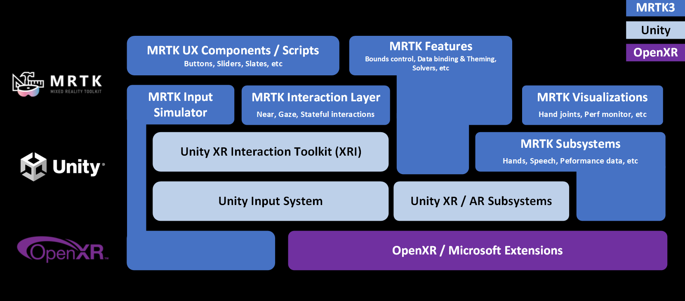

# Architecture overview

One of the goals with MRTK3 was to take everything we've learned from the start of MRTK2 back in early 2018, combine it with the work that's been done by our industry partners across OpenXR and Unity since then, and come out the other side with a strong, extensible foundation that allows MRTK to focus more on providing differentiators and an overall improved user (and developer!) experience.

## Input and interactions

The overall architecture of the input stack of MRTK3 is built on four foundational components:

1. OpenXR
   1. [Khronos Specification](https://www.khronos.org/registry/OpenXR/specs/1.0/html/xrspec.html)
   1. [Unity OpenXR Plugin documentation](https://docs.unity3d.com/Packages/com.unity.xr.openxr@latest)
1. [Unity subsystems](https://docs.unity3d.com/ScriptReference/UnityEngine.SubsystemsModule.html)
1. [Unity's Input System](https://docs.unity3d.com/Packages/com.unity.inputsystem@latest)
1. [Unity's XR Interaction Toolkit](https://docs.unity3d.com/Packages/com.unity.xr.interaction.toolkit@latest)

along with a layer of MRTK-defined [interactors](interactors.md) and [subsystems](subsystems.md), providing features like poke and speech.

### OpenXR

OpenXR is the interface between an application and an XR runtime system, allowing for a common set of features to be called generically and allow the hardware-specific implementation to be handled by the XR runtime. Adopting this in MRTK3, along with Unity's Input System, lets Unity handle more of the cross-platform and extensible input story while allowing MRTK3 to focus on helping you build rich experiences on top.

### Subsystems

[Subsystems](subsystems.md) and Unity's [SubsystemManager](https://docs.unity3d.com/ScriptReference/SubsystemManager.html) should be conceptually familiar to MRTK2 users, as they're the new "data providers". The idea is that different platforms or services can provide an implementation of a specific type of MRTK subsystem and have that run when relevant, providing data to MRTK3 and the app overall, just like data providers did to the various systems in MRTK2. Since we're focusing on OpenXR, the goal is that many features are covered by a cross-vendor EXT extension in OpenXR and multiple subsystems aren't needed, but vendor-specific extensions can represent early tech advancements that we want to support.

### Unity Input System

Conceptually, Unity's Input System will also feel familiar to users of the MRTK2 controller mapping profile. It provides a central place for mapping the buttons and other input axes on a controller or hand to a set of actions. These actions are then consumed by Unity's XR Interaction Toolkit (XRI) and MRTK3, so the object being interacted with doesn't care as much about _what_ is manipulating it, just that it _is_.

### XR Interaction Toolkit

XRI provides a foundation of interactors and interactables. MRTK builds upon this with its own set of [interactors](interactors.md) and [interactables](interactables.md), allowing for additional features like articulated hand tracking, gaze, and pinch.
