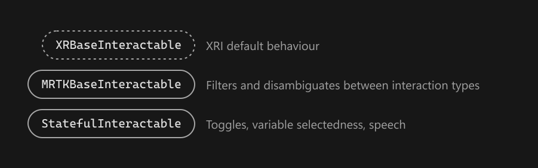
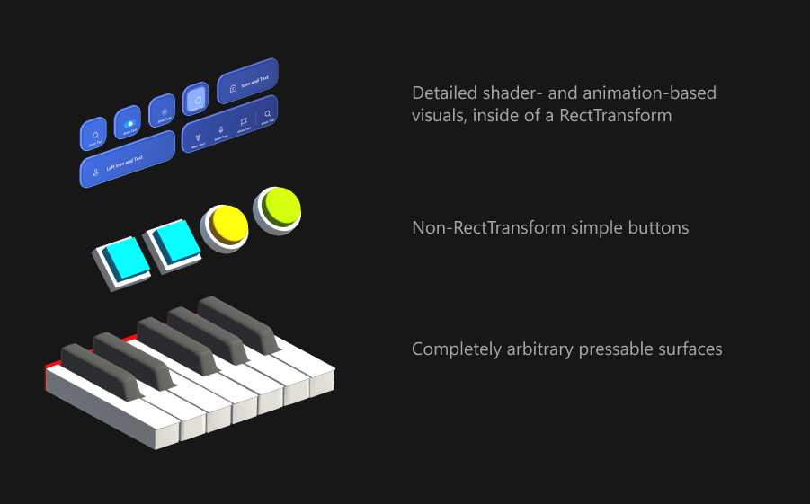
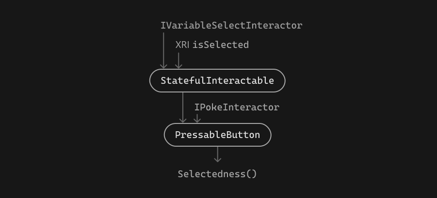
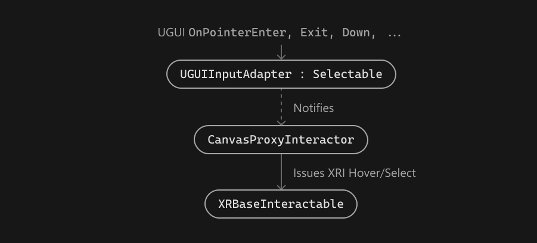

# Interactables — MRTK3

MRTK builds on the `XRBaseInteractable` provided by Unity's XR Interaction Toolkit. The existing interactable behavior and API is fully supported in MRTK, and all of our custom interactables obey the existing XRI interactable API.

For developers new to XRI, we _strongly_ recommend that you first review Unity's [XRI architecture documentation](https://docs.unity3d.com/Packages/com.unity.xr.interaction.toolkit@2.0/manual/architecture.html).

To expand upon the interactable mechanisms included in XRI, MRTK offers two base classes upon which advanced interactions can be built, one extending the other.

- `MRTKBaseInteractable : XRBaseInteractable`
  - This class offers filtering and flagging for different types of interactors. While the base XRI `XRBaseInteractable` doesn't discriminate between interactor types, `MRTKBaseInteractable` provides convenience functions for checking whether common types of interactions are occurring. Convenience properties like `IsGazeHovered` or `IsGrabSelected` are shortcuts to querying whether a participating interactor implements a given interface (correspondingly, `IGazeInteractor` or `IGrabInteractor`). These flags are more performant than iterating through the list of `interactorsHovering` or `interactorsSelecting`. In addition, `MRTKBaseInteractable` can filter/reject certain types of interactors in the case that the developer wishes to exclude certain input modalities.
- `StatefulInteractable : MRTKBaseInteractable`
  - While `MRTKBaseInteractable` adds flags and filters, and avoids adding any additional state to the interactable, `StatefulInteractable` introduces useful stateful features like toggling and variable selection.

## Strict separation of state and visuals

In MRTK 2.x, interactables were often responsible for driving their own visual effects, be it the compressing of a 3D button, a hover effect, or even just changing color on a click. The limitation of this approach is that the interaction logic is tightly bound to the visuals. If you were to redesign the visuals or use a different size/shape/displacement/etc. of button, the interaction script itself would need to change.

In MRTK3, **interactables are pure state and interaction.** The interactable doesn't render any visual changes or effects based on its internal state. It's purely a collection of state and interaction logic that's highly portable between visual presentation setups.

The same `PressableButton` script can be used to build a squishy ball, a pressable "trackpad"-like plane, or an abstract pressable that issues network events on press. The `PressableButton` script doesn't even care "where" it is; it could be inside a Canvas, or on a rigidbody.

To drive visuals, a separate "visual driver" is used to poll the state from the interactable and render the appropriate feedback. `StateVisualizer` is the recommended low-code method for driving common visual feedback effects from interactable state, but developers are free to write their own custom visual drivers. For example, our button components generally use `StateVisualizer` for their advanced 3D + shader-based feedback effects, but we also provide an example `BasicPressableButtonVisuals` that shows how a simple visual driver can be authored in code.

## Variable selection

`StatefulInteractable`'s most useful additional feature over the base XRI functionality is support for variable `Selectedness`. While base XRI interactables are either selected or not selected, MRTK's `StatefulInteractable`s can be any floating-point fraction of selected.

This concept is useful when working in XR, since nearly all forms of input are no longer binary states. Motion controllers often have analog triggers (or analog grips!), hand interactions can provide a variable "pinchedness", and volumetric press interactions can depress a button or pushable surface by a varying amount. You see these variable, analog interactions everywhere in XR, and MRTK is equipped to help developers build delightful interactions on top of these analog inputs.

A wide range of different interactors and types of interactions can all contribute together to the overall Selectedness of an interactable. Notably, all interactors that implement `IVariableSelectInteractor` contribute their analog selection amount, typically through a `max()` of all participating interactors. This variable amount is combined with the binary, non-variable selections coming from vanilla-style interactors.

For derived classes like `PressableButton`, the `Selectedness()` function is overridden to add an additional "ingredient" to the selectedness computation. Interactors that implement `IPokeInteractor` can contribute Selectedness based on their physical location and how they're physically pressing down on the interactable. Other derived classes can introduce other, arbitrary forms of selection.

For the interactables MRTK provides, `Selectedness()` and `isSelected` will always "agree"--in other words, you'll never observe a `Selectedness()` greater than the `SelectThreshold` without a corresponding XRI `isSelected` and an accompanying interactor in `interactorsSelecting`.

> [!IMPORTANT]
> Your custom interactable subclasses can obviously override `Selectedness` to some other value that's completely disconnected from the XRI `isSelected`. However, our interactables don't do this, and we strongly discourage it. **In general, never write _interactions_ that do not have a corresponding _interactor_.** XRI selection will, in the vast majority of cases, be sufficient, and any custom interactions you build should be written as interactors.

When you're creating a custom interactable that supports a new method of determining `Selectedness()`, simply override the method and combine your new selectedness with the existing selection amount. If you're using `StateVisualizer` or any other visual layer that listens to variable selection, it will respond accordingly to your new selection type.

## Map UGUI events to XRI

In some cases, it's desirable to have interactables respond to UGUI events, such as mouse, gamepad, or touchscreen input. The `UGUIInputAdapter`, which is a UGUI `Selectable`, receives UGUI events and forwards them to a `CanvasProxyInteractor`, if one is present.

When the `CanvasProxyInteractor` is notified of the UGUI events by the `UGUIInputAdapter`, it issues _equivalent_ XRI actions on the relevant interactable. The mapping between UGUI input and XRI actions is somewhat lossy and is an area of active development.

With this system, existing XRI interactables that are built for immersive platforms, hands, motion controllers, and 3D input can react equally well to accessible 2D controls like mouse and gamepad.
