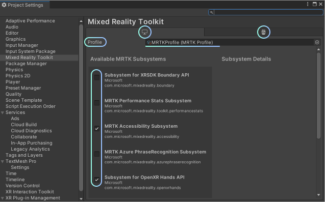
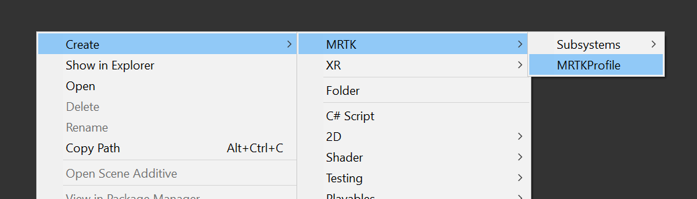
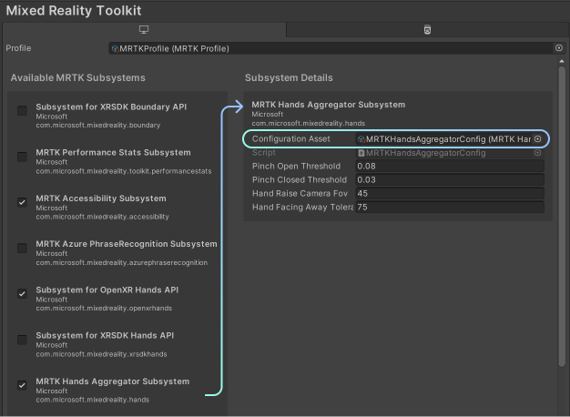
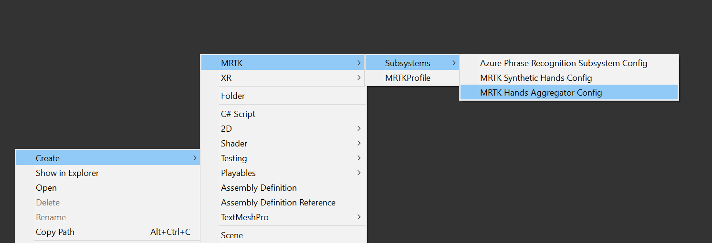

# Subsystems — MRTK3

MRTK3 leverages the Unity XR Subsystem Management infrastructure for writing extensible modules that can help provide cross-platform support for features like speech and hand tracking. These subsystems are initialized and loaded by Unity alongside the existing Unity-native subsystems like `XRMeshSubsystem` and `XRInputSubsystem`. See [the documentation for how Unity subsystems work](https://docs.unity3d.com/ScriptReference/UnityEngine.SubsystemsModule.html).

## Philosophy

In MRTK v2, "services" provided much of the functionality in the scene itself. They would instantiate objects, move objects around, update the scene hierarchy, etc. In MRTK3, the subsystems don't explicitly modify the scene. The MRTK3 subsystems are modular providers of data, information, or events or perform computation for end-users. If something in the scene should change or be acted upon based on data input, there must be a separate scene-based visualizer component to act on the data. This split ensures that the subsystems are non-destructive regarding scene changes and don't cause scene-related side effects.

While MRTK v2 used systems and services liberally for processing input, MRTK3 generally uses OpenXR and the Unity Input System for cross-platform input. However, some types of data are not yet wrapped by the Input System. In these cases, we provide cross-platform interfaces through our subsystems.

## MRTK subsystem lifecycle

The subsystem definitions that are included with Unity's infrastructure offer simple lifecycle methods like `Start`, `Stop`, and `Destroy`. We extend this definition to include helpful "tick" methods, such as  `Update`, `LateUpdate`, and `FixedUpdate`. Our `MRTKLifecycleManager` manages subsystems that implement our lifecycle interface. This lifecycle manager is the only MonoBehaviour involved in the subsystem architecture; this can be placed anywhere in the scene, but we tend to leave it somewhere on the Rig.

## Querying

Querying for a subsystem implementation is straightforward and performant.

```c#
// Gets the first valid implementation of T that is started and running.
T mySubsystem = XRSubsystemHelpers.GetFirstRunningSubsystem<T>();

// Gets the first valid implementation of T, even if it hasn't been started.
T mySubsystem = XRSubsystemHelpers.GetFirstSubsystem<T>();

// If multiple implementations of T are loaded, get all of them.
List<T> allOfThem = new List<T>();
GetAllRunningSubsystemsNonAlloc<T>(allOfThem);
```

## Descriptors

Different implementations of a subsystem can have different capabilities. For example, the different implementations of the `HandsSubsystem` can specify their capability for reporting physical data or synthesized data. This capability information is stored in the subsystem descriptor, and can be queried for any given implementation.

```c#
// Get the first running hands subsystem.
var handsSubsystem = XRSubsystemHelpers.GetFirstRunningSubsystem<HandsSubsystem>();

// If we found one...
if (handsSubsystem != null)
{
    // Read the capability information off the implementation's descriptor.
    bool isPhysicalData = handsSubsystem.subsystemDescriptor.IsPhysicalData;
}
```

## Profiles

Not to be confused with MRTK 2.x's profiles, MRTK3 subsystem profiles are a per-deployment-platform asset that defines which subsystems are created and started.



Subsystems that have their corresponding checkbox checked will be created and started by the `MRTKLifecycleManager` and have their lifecycle methods called. Different profiles can be assigned to different deployment targets.

The subsystems shown here are determined by which packages you've installed. If a package isn't installed, the subsystems associated with that package won't be shown here, and the list auto-refreshes.

There's a pre-made `MRTKProfile` supplied as part of the MRTK v3 package. It's an immutable asset. However, if you'd like to create a custom selection of subsystems to run, you should create your `MRTKProfile` asset within your project.



## Configuration

Subsystems can be assigned configuration objects to customize their behavior.



These configuration objects are accessible from anywhere through the `XRSubsystemHelpers` API.

```c#
XRSubsystemHelpers.GetConfiguration<TConfig, TSubsystem>()
```

Subsystems define which config type is relevant to them in their `MRTKSubsystemAttribute`. Along with this, the attribute also defines several pieces of metadata, along with the concrete types of the implemented provider. For example, this is the attribute that the MRTK Hands Aggregator Subsystem uses.

```c#
[MRTKSubsystem(
        Name = "com.microsoft.mixedreality.hands",
        DisplayName = "MRTK Hands Aggregator Subsystem",
        Author = "Microsoft",
        ProviderType = typeof(MRTKAggregator),
        SubsystemTypeOverride = typeof(MRTKHandsAggregatorSubsystem),
        ConfigType = typeof(MRTKHandsAggregatorConfig))]
```

As with Profiles, default Configuration assets are provided. They're immutable and must be duplicated to your project to be edited. You can also create a new asset through the asset creation menu.


