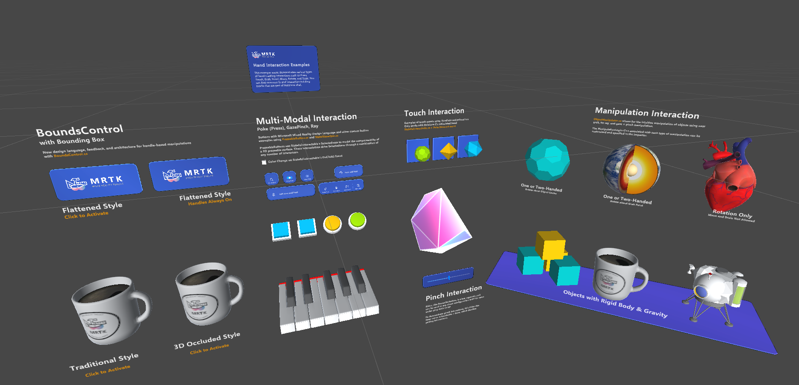

# Exploring MRTK3 sample scenes

Unlike MRTK2, MRTK3 isn't distributed as a Unity project. Instead, MRTK3 consists of a loosely coupled collection of individual UPM packages distributed through the [Mixed Reality Feature Tool](https://learn.microsoft.com/windows/mixed-reality/develop/unity/welcome-to-mr-feature-tool), as well as through our official GitHub repository.

As a result, we no longer ship our sample scenes inside the MRTK library/package itself. Instead, we maintain the `UnityProjects` folder at the top level of the [GitHub repository](https://github.com/MixedRealityToolkit/MixedRealityToolkit-Unity), which contains any Unity projects we want to ship. Currently, this folder includes the `MRTKDevTemplate` project, which contains all of our example scenes and is configured to align with our recommended best settings.

We also recommend using the `MRTKDevTemplate` project for local development when submitting fixes or changes. All of the packages are specified as local on-disk dependencies, making editing and submitting changes easy. Clone the repo and ensure you're on the `mrtk3` branch, and open the `MRTKDevTemplate` Unity project.

Within `MRTKDevTemplate`, you can find all of our sample scenes. Most of the sample scenes are in `UnityProjects/MRTKDevTemplate/Assets/Scenes`, while some experimental or early-preview sample scenes are located in `UnityProjects/MRTKDevTemplate/Assets/Data Binding Example`.

## Included sample scenes

We list below just a few of them.

### HandInteractionExamples

This sample scene offers a wide variety of interaction examples. Despite the name, this scene is a good example of cross-platform input, including hand tracking, controller input, and mouse input. Examples of several different UI controls and interactables are present, including the volumetric UI systems.

### BoundsControlExamples

Various configurations of BoundsControl, showing both flattened and 3D bounds.

### CanvasExample

Shows a collection of UX components built with UnityUI. These UX components are built with a combination of XRI interactables and traditional UGUI event handlers. This combination enables flexibility and responsive design across a wide variety of input methods and contexts.

### CanvasUITearsheet

This scene showcases all available UI building blocks and their permutations in MRTK. All controls are based on the new Mixed Reality Design Language.

### DialogExample

This scene demonstrates use of the Dialog control.

### EyeGazeExample

Example of using the Gaze Interactor to highlight objects within a scene.

### HandMenuExamples

Demonstrates using a menu appearing beside the hand.

### InteractableButtonExamples

An example of different styles of interactable buttons.

### NearMenuExamples

Near interaction menu examples.

### NonCanvasObjectBarExample

Demonstrates the Object Bar component, which enables horizontal or vertical arrangement of arbitrary 3D objects.

### NonCanvasUIBackplateExample

The scene demonstrates `UIBackplate.prefab`, which you can use to construct various types of UI panels and menus.

### SampleEmptyMRTKScene

The sample empty MRTK scene only contains the core MRTK prefab (**MRTK XR Rig**) and the input simulator prefab (**MRTKInputSimulator**). It's intended to give developers an empty scene with only the MRTK essentials necessary to get started.

### SlateDrawingExample

A demonstration of using MRTK3 to create a basic drawing application.

### SpatialMappingExample

The spatial mapping example scene demonstrates using `ARMeshManager` (**MRTK XR Rig > ARSpatialMeshManager**) in MRTK3 to visualize the spatial mesh.

### TabViewExample

Shows a collection of toggles that control the visibility of associated game objects.

### ToggleCollectionExample

Demonstrates the `ToggleCollection` script, which allows multiple toggle interactables to be grouped. Only one toggle can be toggled at any given time.
