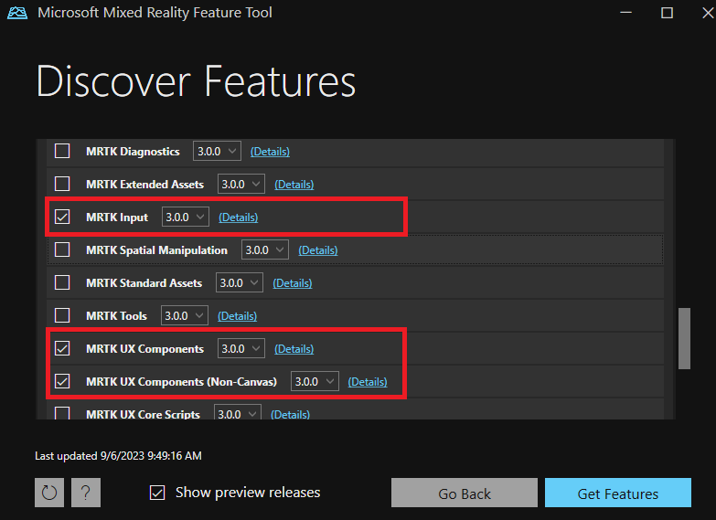

# Starting from a new project

Since MRTK3 is a collection of loosely coupled packages, consuming MRTK3 is done differently than the way you consume MRTK 2.x. We don't ship MRTK as a Unity project, so you have to manually add MRTK3 packages to your project in order to consume them.

You're not expected to consume every MRTK package. See [which features are useful to you](../../packages/packages-overview.md) and add only the dependencies that matter.

## Setting up a new Unity project with MRTK3

### 1. Create a new Unity project

Create a new Unity project with Unity 2021.3.21f1 or newer. Close the Unity project before proceeding to the next step.

### 2. Import required dependencies and MRTK3 packages with Mixed Reality Feature Tool

There are a handful of packages that MRTK3 uses that aren't part of this toolkit. To obtain these packages, use the [`Mixed Reality Feature Tool`](https://learn.microsoft.com/windows/mixed-reality/develop/unity/welcome-to-mr-feature-tool) and select the latest versions of the following in the **Discover Features** step.

- **Platform Support → Mixed Reality OpenXR Plugin**
- **Spatial Audio → Microsoft Spatializer** (Optional)

For MRTK3 packages, we highly recommend the following two packages to help you get started quickly:

- **MRTK3 → MRTK Input** (Required for this setup)
- **MRTK3 → MRTK UX Components**

These two packages, along with their dependencies (automatically added by the Feature Tool), will enable you to explore most of our UX offerings and create projects ready to be deployed to various XR devices. You can always come back to the Feature Tool and add more packages to your project later.

Be sure to select the `org.mixedrealitytoolkit.*` packages, and not the deprecated packages. The `com.microsoft.mrtk.*` packages have been deprecated, and are no longer supported.

> [!NOTE]
> For more information on MRTK3 packages, see the [package overview page](../../packages/packages-overview.md).

When you're finished selecting packages, click **Get features**, and then follow the instructions in the Mixed Reality Feature Tool to import the selected packages into your Unity project.

### 3. Open the Unity project

Open the Unity project and wait for Unity to finish importing the newly added packages. There may be two pop-up messages in this process:

1. The first message asks whether you want to enable the new input backend. Select **yes**.
1. The second message asks whether you want to update XR InteractionLayerMask. Select **No Thanks**.

Unity might restart a few times during this process--wait for it to finish before proceeding.

### 4. Configure MRTK profile after import

Once imported, MRTK3 requires a profile to be set for the standalone target platform and each additional target platform.

1. Navigate to **Edit > Project Settings**.
1. Under **Project Settings**, navigate to **MRTK3** and then switch to the standalone tab. Note that the profile is initially unspecified.
1. Populate the field with the default MRTK profile that ships with the core package. You can type in the keyword "MRTKprofile" in the search bar of the project window; make sure you search in `All`. Alternatively, you can find the profile under `Packages/org.mixedrealitytoolkit.core/Configuration/Default Profiles/MRTKProfile.asset`.
   > [!NOTE]
   > Not all of the MRTK subsystems are shown in the screenshot below. The MRTK subsystems that you see may be different depending on the MRTK3 packages you've added to your project.

   
1. Switch to the tabs of other build target(s) you want to use (for example, UWP, Android) and check to see if the profile is assigned. If not, repeat the previous step on the current tab.

### 5. Configure OpenXR-related settings

Once imported, MRTK3 requires some configuration on OpenXR if you're targeting an XR device such as HoloLens 2 or Quest.

> [!NOTE]
> The following instructions apply to HoloLens 2 or WMR headsets. If you're targeting Quest, refer to the instructions on the [Quest deployment page](../../test-and-deploy/quest-deployment.md#deployment-prerequisites).

1. Navigate to **Edit > Project Settings**.

1. Under **Project Settings**, navigate to **XR Plug-in Management** and enable **OpenXR** under both the Standalone and UWP tabs. Under each tab, ensure that **Initialize XR on Startup** is selected and that the **Windows Mixed Reality feature group under Standalone** and the **Microsoft HoloLens feature group under UWP** are enabled.

    > [!NOTE]
    > A yellow warning icon may appear after checking the **OpenXR** option. Click that icon to open the **OpenXR Project Validation** tool. Click **Fix all** and ignore the interaction profile issue that can't be auto-fixed. The profiles will be added in the step below.

   For standalone:

   

   For UWP:

   

1. Under **Project Settings**, navigate to **XR Plug-in Management > OpenXR > Interaction Profiles** and add the following three profiles for UWP and Standalone:

    - **Eye Gaze Interaction Profile**
    - **Microsoft Hand Interaction Profile**
    - **Microsoft Motion Controller Profile**

    > [!NOTE]
    > You might need to use the **OpenXR Project Validation** tool to eliminate the yellow triangle. Some of the warnings may be resolved manually:   1. Under **Project Settings**, navigate to **Player > Resolution and Presentation**. Ensure that **Run in Background** is unchecked.   2. For UWP, under **Player > Publishing Settings > Capabilities**, ensure that **WebCam**, **Microphone**, **SpatialPerception**, and **GazeInput** are checked if these features are needed by the application. For more information about Window's App Capabilities see [App capability declarations](https://learn.microsoft.com/windows/uwp/packaging/app-capability-declarations).

   For standalone:

   

   For UWP:

   

1. For HoloLens 2, we recommend that you set **Depth Submission Mode** to 16-bit in the settings above.
1. For immersive headsets, you can use 24-bit depth submission. See the [Microsoft development docs for Unity](https://learn.microsoft.com/windows/mixed-reality/develop/unity/recommended-settings-for-unity?tabs=openxr#enable-depth-buffer-sharing) for more info.

### 6. Congratulations, the project setup is now finished

Proceed to [creating a new MRTK3 scene](../setting-up/setup-new-scene.md).

## Next steps

Once you've finished setting up your Unity project, learn how to [experience your application on a device](../../test-and-deploy/overview.md)
