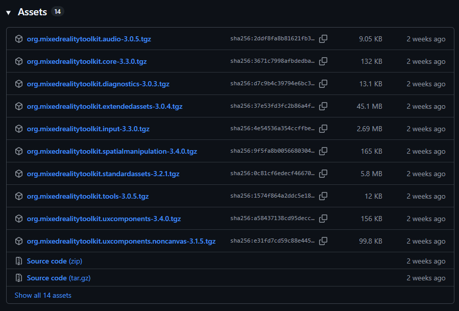
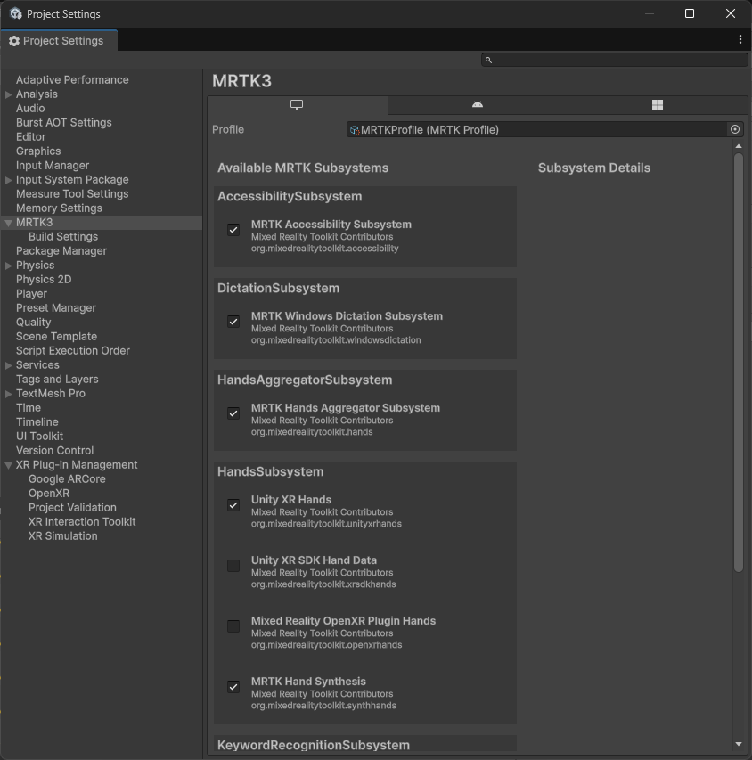

# Starting from a new project

Since MRTK3 is a collection of loosely coupled packages, consuming MRTK3 is done differently than the way you consume MRTK 2.x. We don't ship MRTK as a Unity project, so you have to manually add MRTK3 packages to your project in order to consume them.

You're not expected to consume every MRTK package. See [which features are useful to you](../../packages/packages-overview.md) and add only the dependencies that matter.

## Setting up a new Unity project with MRTK3

### Create a new Unity project

Create a new Unity project with Unity 2021.3.21f1 or newer. Close the Unity project before proceeding to the next step.

### Import MRTK3 packages

For MRTK3 packages, we recommend checking for the [latest release on the GitHub repo](https://github.com/MixedRealityToolkit/MixedRealityToolkit-Unity/releases). The package tarballs can be found under the changelogs, under **Assets**:

- org.mixedrealitytoolkit.core
- org.mixedrealitytoolkit.uxcore
- org.mixedrealitytoolkit.standardassets
- org.mixedrealitytoolkit.spatialmanipulation
- org.mixedrealitytoolkit.uxcomponents
- org.mixedrealitytoolkit.input

We'll also need the latest Mixed Reality Graphics Tools package from [its GitHub repo](https://github.com/microsoft/MixedReality-GraphicsTools-Unity/releases), also under **Assets**.

- com.microsoft.mrtk.graphicstools.unity

Using UPM's ability to [import local tarball files](https://docs.unity3d.com/6000.0/Documentation/Manual/upm-ui-tarball.html), we'll import the above packages in the following order, to correctly resolve dependencies:

- com.microsoft.mrtk.graphicstools.unity
- org.mixedrealitytoolkit.core
- org.mixedrealitytoolkit.uxcore
- org.mixedrealitytoolkit.standardassets
- org.mixedrealitytoolkit.spatialmanipulation
- org.mixedrealitytoolkit.uxcomponents
- org.mixedrealitytoolkit.input

These packages, along with their Unity dependencies, will enable you to explore most of our UX offerings and create projects ready to be deployed to various XR devices. You can always come back and add more packages to your project later.

> [!NOTE]
> For more information on MRTK3 packages, see the [package overview page](../../packages/packages-overview.md).

#### Additional dependencies

There are a handful of optional packages that MRTK3 uses that aren't part of this toolkit. To obtain these packages, use the [Mixed Reality Feature Tool](./mixed-reality-feature-tool.md) and select the latest versions of the following in the **Discover Features** step.

To run on **HoloLens 2** or to visualize controller models on a **Quest device**, an additional package is required:

- **Platform Support → Mixed Reality OpenXR Plugin**

To spatialize audio in your scene, an additional package is required:

- **Spatial Audio → Microsoft Spatializer** (Optional)

### Open the Unity project

Open the Unity project and wait for Unity to finish importing the newly added packages. There may be two pop-up messages in this process:

1. The first message asks whether you want to enable the new input backend. Select **yes**.
1. The second message asks whether you want to update XR InteractionLayerMask. Select **No Thanks**.

Unity might restart a few times during this process; wait for it to finish before proceeding.

### Configure MRTK profile after import

Once imported, MRTK3 requires a profile to be set for the standalone target platform and each additional target platform.

1. Navigate to **Edit > Project Settings**.
1. Under **Project Settings**, navigate to **MRTK3** and then switch to the standalone tab. Note that the profile is initially unspecified.
1. Populate the field with the default MRTK profile that ships with the core package. You can click the "Assign MRTK Default" button to auto-populate this field. Alternatively, you can find the profile under `Packages/org.mixedrealitytoolkit.core/Configuration/Default Profiles/MRTKProfile.asset`.

    > [!NOTE]
    > Not all of the MRTK subsystems are shown in the screenshot below. The MRTK subsystems that you see may be different depending on the MRTK3 packages you've added to your project.

    

1. Switch to the tabs of other build target(s) you want to use (for example, UWP, Android) and check to see if the profile is assigned. If not, repeat the previous step on the current tab.

### Configure OpenXR-related settings

Once imported, MRTK3 requires some configuration on OpenXR if you're targeting a specific XR device. Refer to the instructions on the following pages for platform-specific guidance.

- [Deploy to an Android XR device](../../test-and-deploy/android-xr-deployment.md)
- [Deploy to a Quest device](../../test-and-deploy/quest-deployment.md)
- [Deploy to HoloLens 2](../../test-and-deploy/hololens2-deployment.md)

## Next steps

Once you've finished setting up your Unity project, proceed to [creating a new MRTK3 scene](./setup-new-scene.md).
