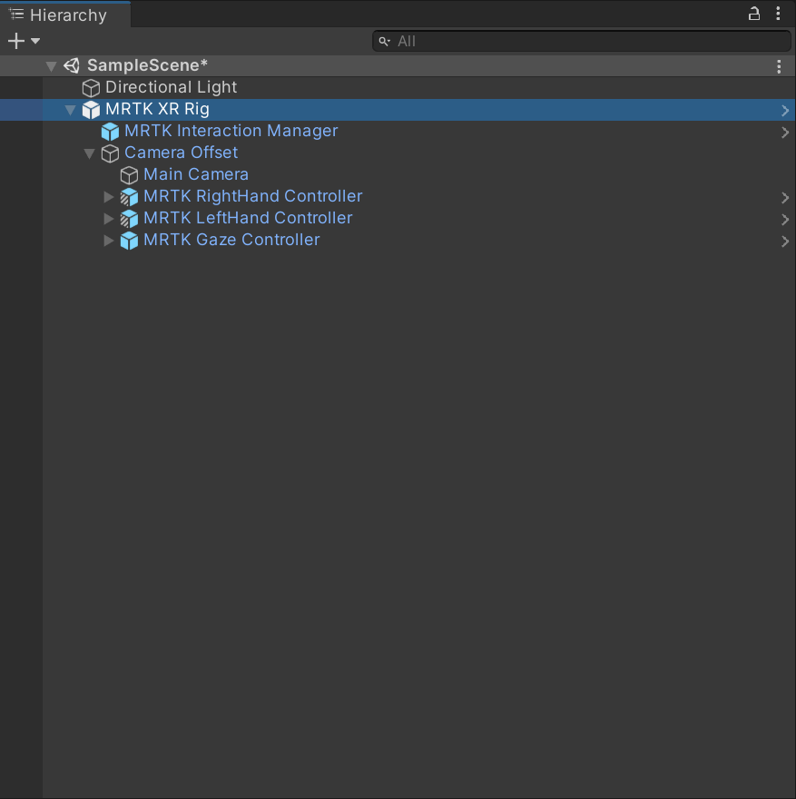
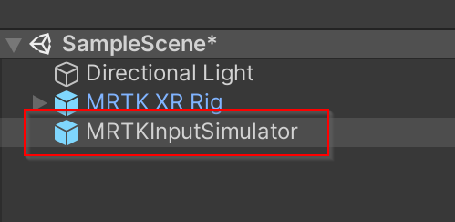

# Creating a new scene with MRTK3

The following will walk through through creating a AR/VR ready scene using MRTK3.

1. Create a new Unity scene.
1. Add the **MRTK XR Rig** prefab.
1. Remove the **Main Camera** Game Object because  **MRTK XR Rig** already contains a camera.

   

1. Add the MRTK Input Simulator prefab to your scene.

    > [!NOTE]
    > This step is optional, but required by in-editor simulations.

    
