# Mixed Reality Toolkit 3

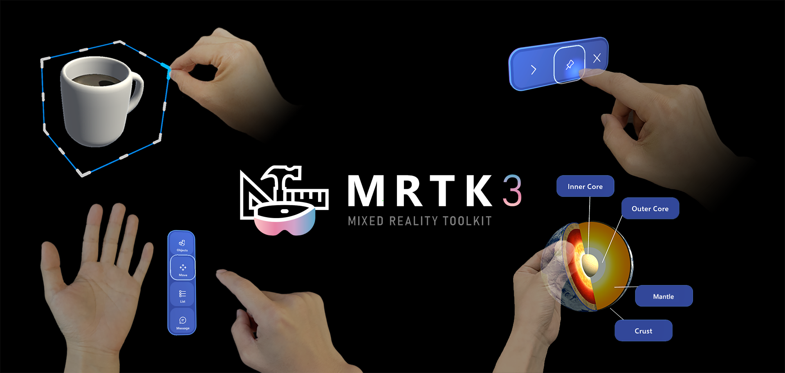

Mixed Reality Toolkit 3 is an open-source project to accelerate cross-platform mixed reality development in Unity. MRTK3 is built on top of Unity's XR Management system and XR Interaction Toolkit. Here are some of its functions:

* Provides the **cross-platform input system and building blocks for spatial interactions and UI**.
* Enables **rapid prototyping** via in-editor simulation that allows you to see changes immediately.
* Operates as an **extensible framework** that allows developers the ability to swap out core components.
* **Supports a wide range of platforms:**

| Platform | Supported Devices |
|---|---|
| OpenXR devices | [Android XR](https://www.android.com/xr/)   Microsoft HoloLens 2   Meta Quest   Magic Leap 2   Lenovo ThinkReality A3 (with [Qualcomm Snapdragon Spaces](https://docs.spaces.qualcomm.com/unity/samples/preview/mrtk3-setup-guide))   Windows Mixed Reality (experimental)   SteamVR (experimental) |
| Windows | Traditional flat-screen desktop (experimental) |
| And more! | Coming soon! |

## Welcome to MRTK3

[Mixed Reality Toolkit Organization](https://github.com/MixedRealityToolkit) currently maintains MRTK3, and released MRTK3 for general availability (GA).

### Key improvements

#### Architecture

* Built on Unity XR Interaction Toolkit and the Unity Input System.
* OpenXR focused.
* Open-ended and flexible interaction paradigms.

#### Performance

* Rewrote and redesigned most features and systems, from UX to input to subsystems.
* Zero per-frame memory allocation.
* Tuned for maximum performance on mixed reality devices and other resource-constrained mobile platforms.

#### User Interface

* New interaction models (gaze-pinch indirect manipulation).
* Updated Mixed Reality Design Language.
* Unity Canvas + 3D UX: production-grade dynamic auto-layout.
* Unified 2D & 3D input for gamepad, mouse, and accessibility support.
* Data binding for branding, theming, dynamic data, and complex lists.

#### Accessibility (Early Preview)

* Low vision aids.
* Input assistance.

#### Long Term Support

* Minimum requirements: OpenXR, Unity 2022.3 LTS, Unity’s XR Interaction Toolkit 3.0.

## Versioning

In previous versions of MRTK (HoloToolkit and MRTK v2), all packages were released as a complete set, marked with the same version number (ex: 2.8.0). Starting with MRTK3, each package is individually versioned, following the [Semantic Versioning 2.0.0 specification](https://semver.org/spec/v2.0.0.html).

> [!NOTE]
> The '3' in MRTK3 is not a version number. It's an indicator of the generation of the underlying architecture, with HoloToolkit being generation one and MRTK v2.x being generation two.

Individual versioning will enable faster servicing while providing improved developer understanding of the magnitude of changes and reducing the number of packages needing to be updated to acquire the desired fix(es).

For example, if a non-breaking new feature is added to the UX core package that contains the logic for user interface behavior, the minor version number will increase (from 3.0.x to 3.1.0). Since the change is non-breaking, the UX components package, which depends upon UX core, is not required to be updated.

As a result of this change, there isn't a unified MRTK3 product version.

To help identify specific packages and their versions, MRTK3 provides an "about" dialog that lists the relevant packages included in the project. To access this dialog, in Unity on the menu bar, select `Mixed Reality` > `MRTK3` > `About MRTK`.

## Branch Status

[Mixed Reality Toolkit Organization](https://github.com/MixedRealityToolkit) currently maintains and updates MRTK3. We appreciate your feedback, and you can open bugs and feature request at the [Mixed Reality Toolkit for Unity](https://github.com/MixedRealityToolkit/MixedRealityToolkit-Unity) GitHub project.

### Early preview packages

Some parts of MRTK3 are at earlier stages of the development process than others. Early preview packages can be identified in the Mixed Reality Feature Tool and Unity Package Manager by the `Early Preview` designation in their names.

As of November 2025, the following components are considered to be in early preview.

| Name | Package Name |
| --- | --- |
| Accessibility | org.mixedrealitytoolkit.accessibility |
| Data Binding and Theming | org.mixedrealitytoolkit.data |

We encourage you to provide any and all feedback to help shape the final form of these early preview features.

## UX building blocks

| | | |
|---|---|---|
| 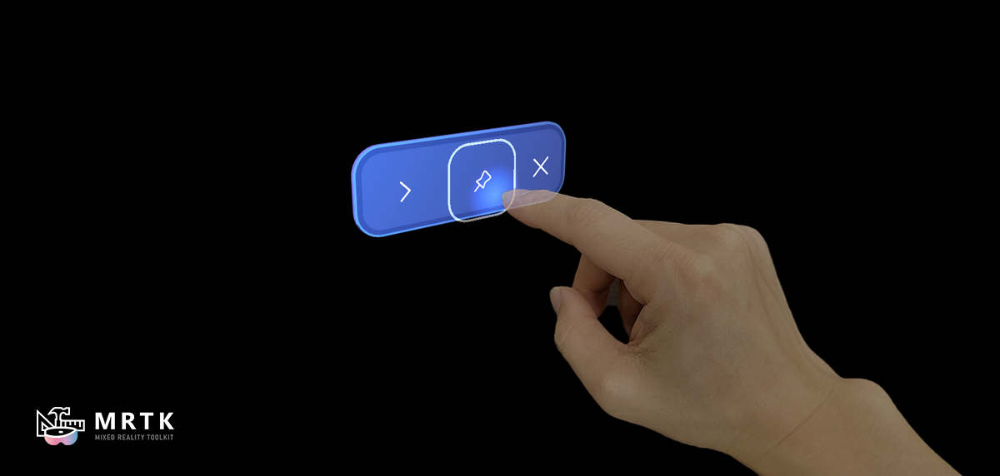   **Button**   A volumetric button optimized for a wide range of input modalities, including poking, gaze-pinch, ray interactions, mouse click, and gamepad. | 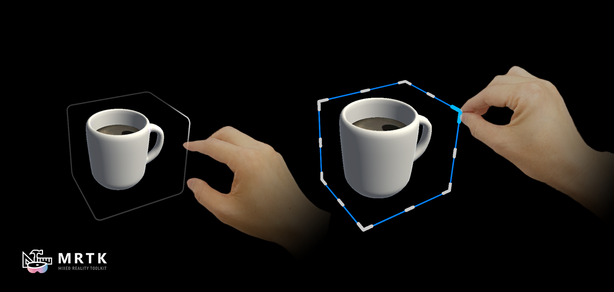   **Bounds Control**   Intent feedback and precision manipulation affordances. | 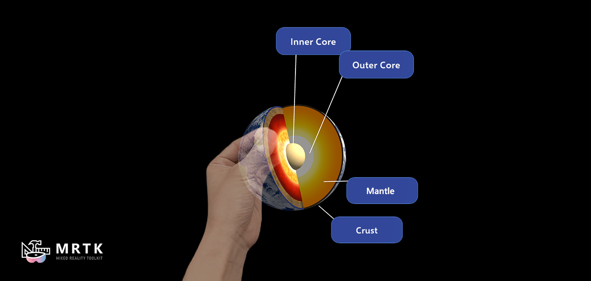   **Object Manipulator**   Move and manipulate objects with one or two hands with a wide variety of input modalities. |
| 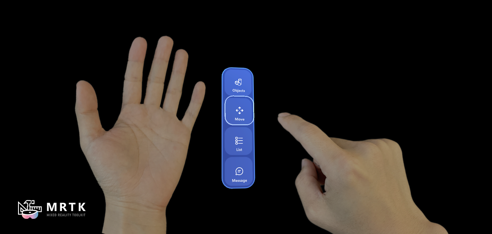   **Hand Menu**   A hand-anchored collection of UX controls for easy access to quick actions. | 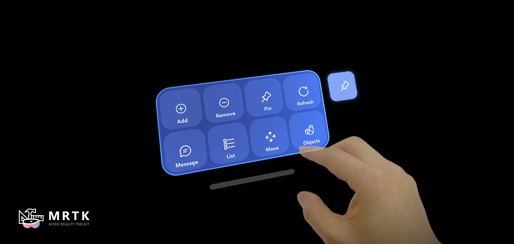   **Near Menu**   Collection of UX controls that can be manipulated, pinned, and set to follow the user. | 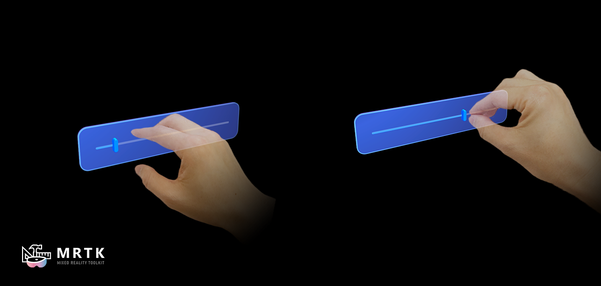   **Slider**   Adjust a value along a one-dimensional axis. |
|    **Solver**   Various object positioning behaviors such as tag-along, body-lock, constant view size and surface magnetism. | 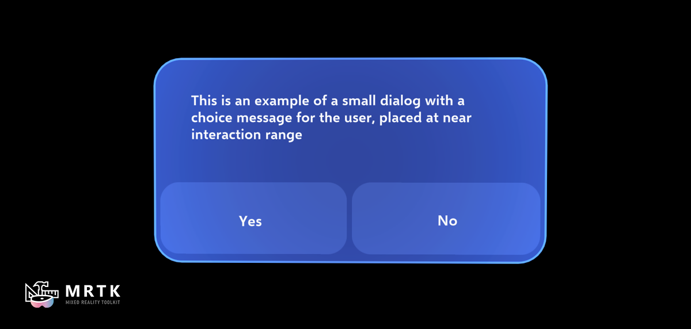   **Dialog**   Prompt for user action. | 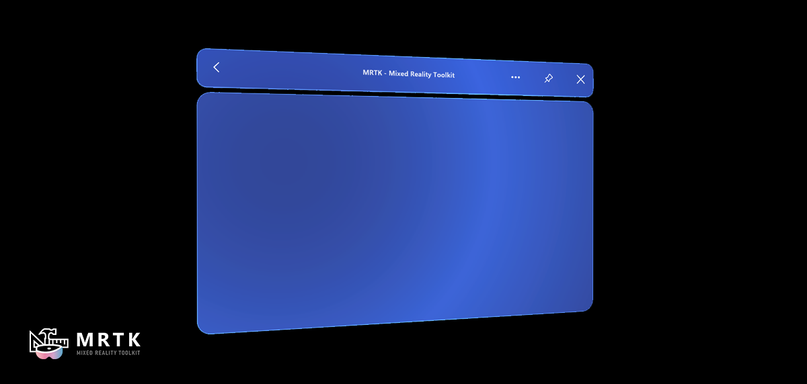   **Slate**   A flat panel for displaying large-format interfaces and content. |

### Figma Toolkit for MRTK3 Preview

The [prerelease of Figma Toolkit for MRTK3](https://www.figma.com/community/file/1145959192595816999) includes UI components based on Microsoft's new Mixed Reality Design Language introduced in MRTK3. You can use the 2D representations of the components in the design process for creating UI layouts and storyboards.

## Session videos from Microsoft Mixed Reality Dev Days 2022

| | | |
|---|---|---|
| [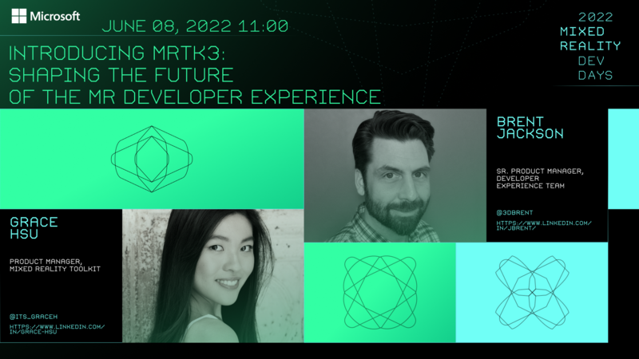](https://youtu.be/fjQFkeF-ZOM?list=PLlrxD0HtieHhkPlibqfQf1pGvM0vLNPpL)   **[Introducing MRTK3 – Shaping the future of the MR Developer Experience](https://youtu.be/fjQFkeF-ZOM?list=PLlrxD0HtieHhkPlibqfQf1pGvM0vLNPpL)** | [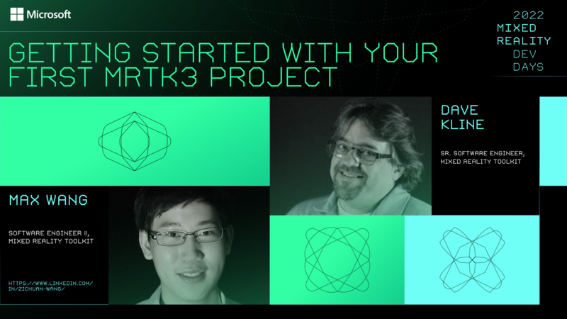](https://youtu.be/aVnwIq4VUcY?list=PLlrxD0HtieHhkPlibqfQf1pGvM0vLNPpL)   **[Getting started with your first MRTK3 project](https://youtu.be/aVnwIq4VUcY?list=PLlrxD0HtieHhkPlibqfQf1pGvM0vLNPpL)** | [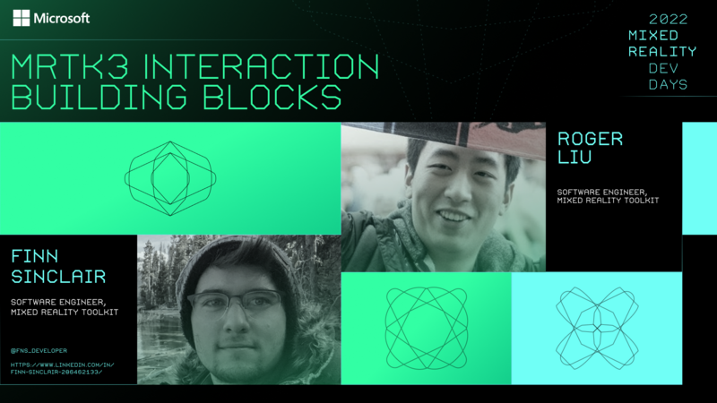](https://youtu.be/naVziEJ-yDg?list=PLlrxD0HtieHhkPlibqfQf1pGvM0vLNPpL)   **[MRTK3 Interaction building blocks](https://youtu.be/naVziEJ-yDg?list=PLlrxD0HtieHhkPlibqfQf1pGvM0vLNPpL)** |
| [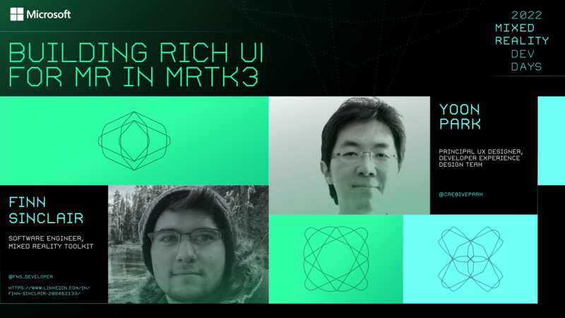](https://youtu.be/g2HF5HMy-2c?list=PLlrxD0HtieHhkPlibqfQf1pGvM0vLNPpL)   **[Building Rich UI for MR in MRTK3](https://youtu.be/g2HF5HMy-2c?list=PLlrxD0HtieHhkPlibqfQf1pGvM0vLNPpL)** | [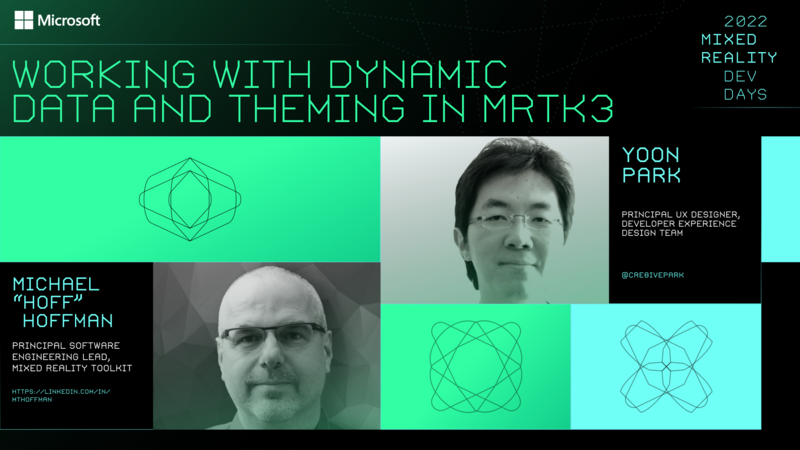](https://youtu.be/IiTpZ2ojyno?list=PLlrxD0HtieHhkPlibqfQf1pGvM0vLNPpL)   **[Working with Dynamic Data and Theming in MRTK3](https://youtu.be/IiTpZ2ojyno?list=PLlrxD0HtieHhkPlibqfQf1pGvM0vLNPpL)** | [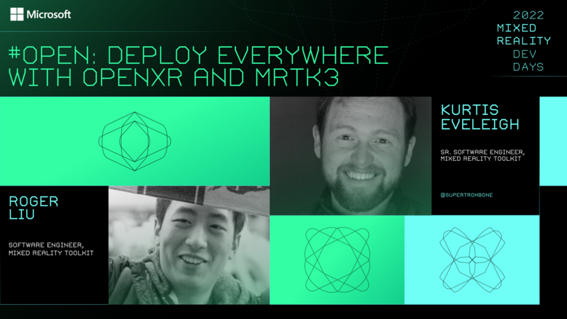](https://youtu.be/LI6lyW9TG9o?list=PLlrxD0HtieHhkPlibqfQf1pGvM0vLNPpL)   **[#Open - Deploy Everywhere with OpenXR and MRTK3](https://youtu.be/LI6lyW9TG9o?list=PLlrxD0HtieHhkPlibqfQf1pGvM0vLNPpL)** |

## Roadmap

[Mixed Reality Toolkit Organization](https://github.com/MixedRealityToolkit) will announce future releases.
