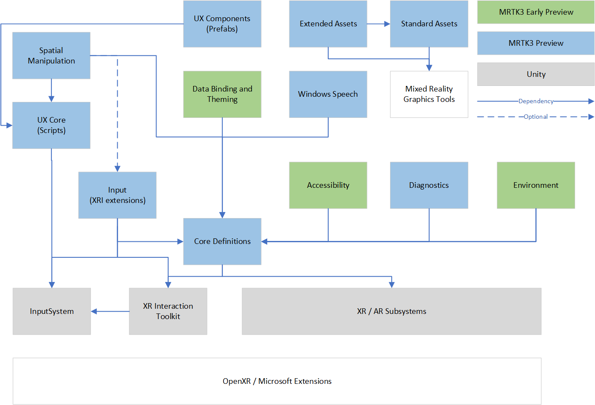

# Using MRTK3 packages

Microsoft MRTK3 is distributed as a set of packages that are imported into Unity using the Mixed Reality Feature Tool for Unity and the Unity Package Manager (UPM). These packages enable developers to customize the MRTK within their projects.

## Dependencies

Some MRTK3 packages require additional packages, provided by Microsoft and/or Unity, in order to correctly function. Some of these packages are optional and will enable additional functionality.

The following diagram illustrates the relationship between MRTK packages and some of the Unity dependencies.

> [!NOTE]
> When importing packages using the Mixed Reality Feature Tool, dependency management is automatically performed.

The following table describes the Mixed Reality Toolkit package dependencies.

| Display name | Package name | Description | Required  | Optional  |
| ----------- | ----------- | --------- | -------- | ---------- |
| MRTK Core Definitions |  org.mixedrealitytoolkit.core | Shared definitions, utilities and components. | <ul> <li> com.unity.xr.interaction.toolkit </li> <li> com.unity.xr.management </li> </ul> | |
| MRTK Accessibility | org.mixedrealitytoolkit.accessibility | Definitions, features and subsystem for building accessible mixed reality experiences. | <ul> <li> org.mixedrealitytoolkit.core </li> <li> org.mixedrealitytoolkit.graphicstools.unity </li> <li> com.unity.textmeshpro </li> </ul> | |
| MRTK Audio Effects | org.mixedrealitytoolkit.audio | Effects and features that enhance the audio in mixed reality experiences. | <ul> <li> org.mixedrealitytoolkit.core </li> </ul> | |
| MRTK Data Binding and Theming | org.mixedrealitytoolkit.data | Support for data binding and UI element theming. | <ul> <li> org.mixedrealitytoolkit.core </li> <li> com.unity.nuget.newtonsoft-json </li> <li> com.unity.textmeshpro </li> </ul> |  |
| MRTK Diagnostics | org.mixedrealitytoolkit.diagnostics | Diagnostics and performance monitoring subsystems and tools. | <ul> <li> org.mixedrealitytoolkit.core </li> <li> com.unity.xr.management </li> </ul> | |
| MRTK Environment | org.mixedrealitytoolkit.environment | Environmental features and subsystems, such as Spatial Awareness and boundaries. | <ul> <li> org.mixedrealitytoolkit.core </li> <li> com.unity.xr.management </li> </ul> |  |
| MRTK Extended Assets | org.mixedrealitytoolkit.extendedassets | Additional audio, font, texture and other assets for use in applications. | <ul> <li> org.mixedrealitytoolkit.standardassets </li> <li> org.mixedrealitytoolkit.graphicstools.unity </li> </ul> | |
| MRTK Graphics Tools | org.mixedrealitytoolkit.graphicstools.unity | Shaders, textures, materials and models. | | <ul> <li> com.unity.render-pipelines.universal </li> </ul> |
| MRTK Input | org.mixedrealitytoolkit.input | Input components including support for articulated hands, offline speech recognition and in-editor input simulation. | <ul> <li> org.mixedrealitytoolkit.core </li> <li> org.mixedrealitytoolkit.graphicstools.unity </li> <li> com.unity.xr.interaction.toolkit </li> <li> com.unity.inputsystem </li> <li> com.unity.xr.management </li> <li> com.unity.xr.openxr </li> <li> com.unity.xr.arfoundation </li> </ul> | |
| MRTK Spatial Manipulation | org.mixedrealitytoolkit.spatialmanipulation | Spatial positioning and manipulation components and utilities, including solvers. | <ul> <li> org.mixedrealitytoolkit.core </li> <li> org.mixedrealitytoolkit.uxcore </li> <li> com.unity.inputsystem </li> <li> com.unity.xr.interaction.toolkit </li> </ul> | <ul> <li> org.mixedrealitytoolkit.input </li> </ul> |
| MRTK Standard Assets | org.mixedrealitytoolkit.standardassets | Standard assets, including materials and textures, for use by applications. | <ul> <li> org.mixedrealitytoolkit.graphicstools.unity </li> </ul> | |
| MRTK Tools | org.mixedrealitytoolkit.tools | Collection of Unity Editor tools used to extend and optimize MRTK3 applications. | <ul> <li> org.mixedrealitytoolkit.core </li> </ul> | |
| MRTK UX Components | org.mixedrealitytoolkit.uxcomponents | MRTK UX component library, containing prefabs, visuals, pre-made controls, and everything to get started building 3D user interfaces for mixed reality. | <ul> <li> org.mixedrealitytoolkit.uxcore </li> <li> org.mixedrealitytoolkit.spatialmanipulation </li> <li> com.microsoft.standardassets </li> </ul> | |
| MRTK UX Components (Non-Canvas) | org.mixedrealitytoolkit.uxcomponents.noncanvas | MRTK non-Canvas UX component library, for building 3D UX without Canvas layout. For most production-grade UI, we recommend the dynamic hybrid Canvas-based UX systems, located in org.mixedrealitytoolkit.uxcomponents. However, in some circumstances, static/non-Canvas UI may offer improved performance and batching, and may be desirable in resource-constrained scenarios. | <ul> <li> org.mixedrealitytoolkit.uxcore </li> <li> org.mixedrealitytoolkit.spatialmanipulation </li> <li> com.microsoft.standardassets </li> </ul> | |
| MRTK UX Core | org.mixedrealitytoolkit.uxcore | Core interaction and visualization scripts for building MR user interface components.\n\nNote: this is intended to be consumed in order to build UX libraries. To build MR interfaces with a pre-existing library of components, see org.mixedrealitytoolkit.uxcomponents. | <ul> <li> org.mixedrealitytoolkit.core </li> <li> org.mixedrealitytoolkit.graphicstools.unity </li> <li> com.unity.inputsystem </li> <li> com.unity.textmeshpro </li> <li> com.unity.xr.interaction.toolkit </li> </ul> | <ul> <li> org.mixedrealitytoolkit.data </li> </ul> |
| MRTK Windows Speech | org.mixedrealitytoolkit.windowsspeech | Speech subsystem implementation for native Windows speech APIs. Allows for the use of native Windows speech recognition to fire events and drive XRI interactions. | <ul> <li> org.mixedrealitytoolkit.core </li> </ul> | |

## Running package tests

Some MRTK packages contain tests used to validate the included components. In some cases, these tests require additional MRTK packages not asserted as dependencies.

> [!NOTE]
> When importing packages into Unity, test assemblies aren't compiled by default. To enable compilation of tests, please use the `testables` element of the project's `manifest.json` file.

In order to place minimal overhead on applications importing the Mixed Reality Toolkit, dependencies are asserted only for runtime requirements. The following table describes the additional packages required to enable compiling and running the included test assemblies.

| Display name | Package name | Test requirements |
| ------------ | ------------ | ----------------- |
| MRTK Core Definitions | org.mixedrealitytoolkit.core  | |
| MRTK Accessibility | org.mixedrealitytoolkit.accessibility | |
| MRTK Data Binding and Theming | org.mixedrealitytoolkit.data | |
| MRTK Diagnostics | org.mixedrealitytoolkit.diagnostics | |
| MRTK Environment | org.mixedrealitytoolkit.environment | |
| MRTK Extended Assets | org.mixedrealitytoolkit.extendedassets | |
| MRTK Input | org.mixedrealitytoolkit.input |  |
| MRTK Spatial Manipulation | org.mixedrealitytoolkit.spatialmanipulation | org.mixedrealitytoolkit.input |
| MRTK Standard Assets | org.mixedrealitytoolkit.standardassets | |
| MRTK UX Components | org.mixedrealitytoolkit.uxcomponents | org.mixedrealitytoolkit.input |
| MRTK UX Core | org.mixedrealitytoolkit.uxcore | org.mixedrealitytoolkit.input |
| MRTK Windows Speech | org.mixedrealitytoolkit.windowsspeech | |
