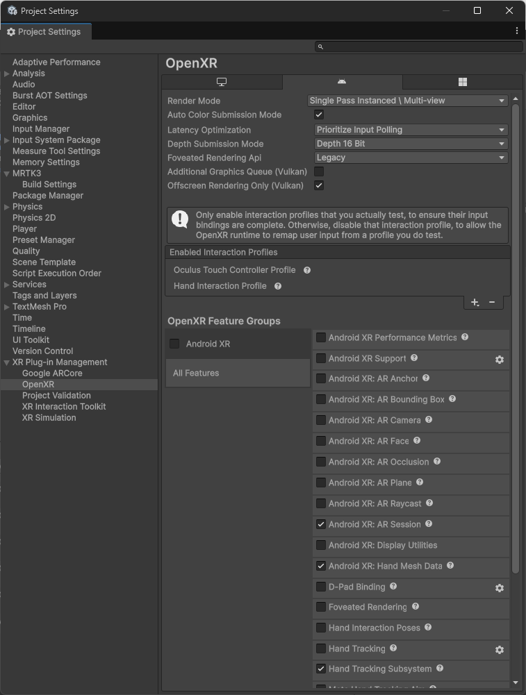

# Deploy to an Android XR device

This page describes how to deploy your Unity Project with MRTK3 onto an Android XR device.

> [!NOTE]
> For general Android XR and Unity information, see the [Android XR developer docs](https://developer.android.com/develop/xr/unity).

## Deployment Prerequisites

1. Add MRTK to your project and ensure your [project settings](../getting-started/setting-up/setup-new-project.md#5-configure-openxr-related-settings) are configured correctly to use the OpenXR pipeline and MRTK's feature set. **These features are required to deploy your project onto your Android XR device**.

    > [!NOTE]
    > If starting from the [template project](../getting-started/setting-up/setup-template.md), these project settings should already be configured for you.

1. Navigate to **File > Build Settings**.

1. Under **Platform**, select **Android**. Switch the platform to **Android**, and wait for the operation to finish.

1. Navigate to **Edit > Project Settings**.

1. Under **Project Settings**, navigate to **XR Plug-in Management** and enable **OpenXR** under the **Android** tab. Ensure that **Initialize XR on Startup** is selected and that no feature groups are enabled, and wait for the operation to finish.

    

    > [!NOTE]
    > A yellow warning icon may appear after checking the **OpenXR** option. Click that icon to open the **OpenXR Project Validation** tool. Click **Fix All** and ignore the interaction profile issue that can't be auto-fixed. The profiles will be added in the step below.

1. Under **Project Settings**, navigate to **XR Plug-in Management > OpenXR > Interaction Profiles** and ensure the following profiles are listed based on the MRTK features you'd like to use:

    | Profile | MRTK |
    |---------|------|
    | Hand Interaction Profile | For articulated hand input |
    | Oculus Touch Controller Profile | For controller input |

1. Under **Project Settings**, navigate to **XR Plug-in Management > OpenXR > OpenXR Feature Groups** and ensure the following features are checked under **All Features** based on the MRTK features you'd like to use:

    | Feature | MRTK |
    |---------|------|
    | Android XR: AR Session   Android XR: Hand Mesh Data | For rendering the system hand mesh |
    | Hand Tracking Subsystem | For rendering the articulated hand joints |

    

    > [!NOTE]
    > You can enable additional features as needed, but in-scene support for them will come from other packages, like AR Foundation.

1. A yellow warning icon or red error icon may appear during this process. Click that icon to open the **OpenXR Project Validation** tool. Select **Fix All** to address the issues. There may be several items to address.

## Deploying to Device

1. After you have the project configured, proceed to [build and run the Unity Project](https://docs.unity3d.com/Manual/xr-run.html).
