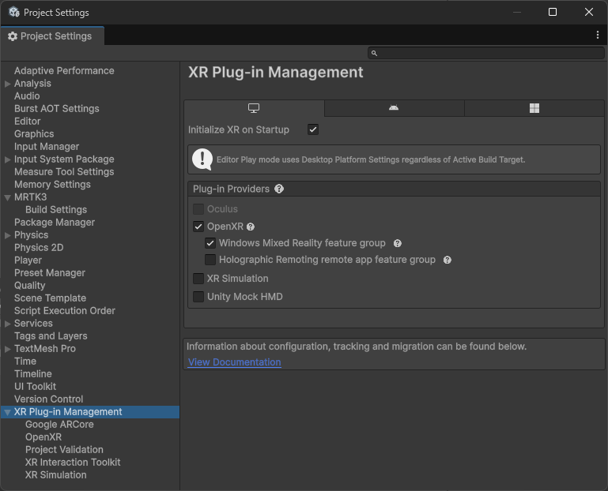
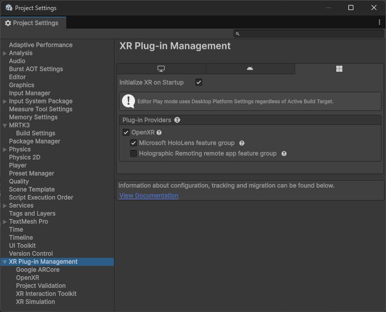
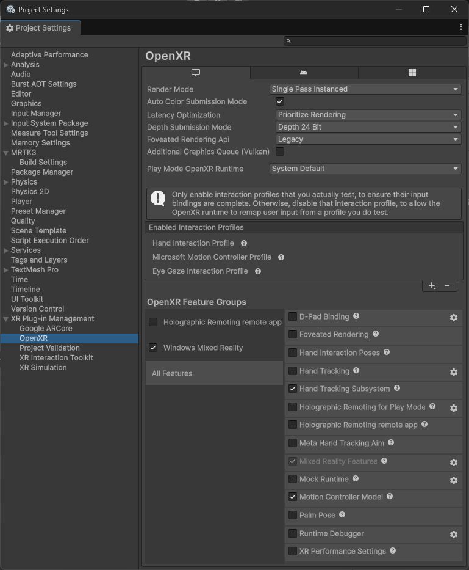
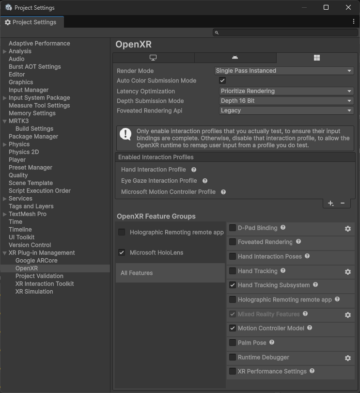

# Deploy to HoloLens 2

This page describes how to deploy your Unity Project with MRTK3 onto a HoloLens 2.

> [!NOTE]
> We strongly recommend using [Holographic remoting](streaming.md) for rapid iteration and testing on HoloLens 2, which allows for instant testing on the device without the need for compile + deploy.

## Deployment Prerequisites

1. Add MRTK to your project and ensure your [project settings](../getting-started/setting-up/setup-new-project.md#5-configure-openxr-related-settings) are configured correctly to use the OpenXR pipeline and MRTK's feature set. **These features are required to deploy your project onto your HoloLens**.

    > [!NOTE]
    > If starting from our [template project](../getting-started/setting-up/setup-template.md), these project settings should already be configured for you.

1. Navigate to **File > Build Settings**.

1. Under **Platform**, select **Universal Windows Platform**. Switch the platform to **Universal Windows Platform**, and wait for the operation to finish.

1. Navigate to **Edit > Project Settings**.

1. Under **Project Settings**, navigate to **XR Plug-in Management** and enable **OpenXR** under both the **Standalone** and **UWP** tabs. Under each tab, ensure that **Initialize XR on Startup** is selected and that the **Windows Mixed Reality feature group** under **Standalone** and the **Microsoft HoloLens feature group** under **UWP** are enabled.

    > [!NOTE]
    > If you don't see these **feature groups**, ensure the **Mixed Reality OpenXR Plugin** is imported into your project.

    For standalone:

    

    For UWP:

    

    > [!NOTE]
    > A yellow warning icon may appear after checking the **OpenXR** option. Click that icon to open the **OpenXR Project Validation** tool. Click **Fix all** and ignore the interaction profile issue that can't be auto-fixed. The profiles will be added in the step below.

1. Under **Project Settings**, navigate to **XR Plug-in Management > OpenXR > Interaction Profiles** and ensure the following profiles are listed based on the MRTK features you'd like to use:

    | Profile | MRTK |
    |---------|------|
    | Eye Gaze Interaction Profile | For eye tracking input |
    | Hand Interaction Profile | For articulated hand input |
    | Microsoft Motion Controller Profile | For controller input |

1. Under **Project Settings**, navigate to **XR Plug-in Management > OpenXR > OpenXR Feature Groups** and ensure the following features are checked under **All Features** based on the MRTK features you'd like to use (these are likely to be already checked after selecting the **feature groups** above):

    | Feature | MRTK |
    |---------|------|
    | Hand Tracking Subsystem | For rendering the articulated hand joints |
    | Mixed Reality Features | For general HoloLens and WMR support |
    | Motion Controller Model | For rendering the motion controller models |

    For standalone:

    

    For UWP:

    

    > [!NOTE]
    > You can enable additional features as needed, but in-scene support for them will come from other packages, like AR Foundation.

1. For HoloLens 2, we recommend that you set **Depth Submission Mode** to 16-bit in the settings above.

1. For immersive headsets, you can use 24-bit depth submission. See the [Microsoft development docs for Unity](https://learn.microsoft.com/windows/mixed-reality/develop/unity/recommended-settings-for-unity?tabs=openxr#enable-depth-buffer-sharing) for more info.

1. A yellow warning icon or red error icon may appear during this process. Click that icon to open the **OpenXR Project Validation** tool. Select **Fix All** to address the issues. There may be several items to address. For more information about Windows App Capabilities, see [App capability declarations](https://learn.microsoft.com/windows/uwp/packaging/app-capability-declarations)

## Using platform controller models

> [!NOTE]
> **Controller models** are stored in a format that is not natively supported by Unity. To use MRTK Controller Visualization on WMR, you will need to make sure you have the following package in your project:
>
> - [glTFast importer](https://github.com/atteneder/glTFast) which enables the use of glTF asset files in Unity and allows the use of MRTK Controller Visualization on WMR
>
> If you started with the MRTK3 template project, this package has already been included in the project.
> If not, an MRTK project validation rule will help you import the package.

## Deploying to Device

1. After you have the project configured, proceed to [Build the Unity Project](https://learn.microsoft.com/windows/mixed-reality/develop/unity/build-and-deploy-to-hololens#build-the-unity-project).

1. Once built, you'll need to deploy the project through [Visual Studio](https://learn.microsoft.com/windows/mixed-reality/develop/advanced-concepts/using-visual-studio?tabs=hl2).
