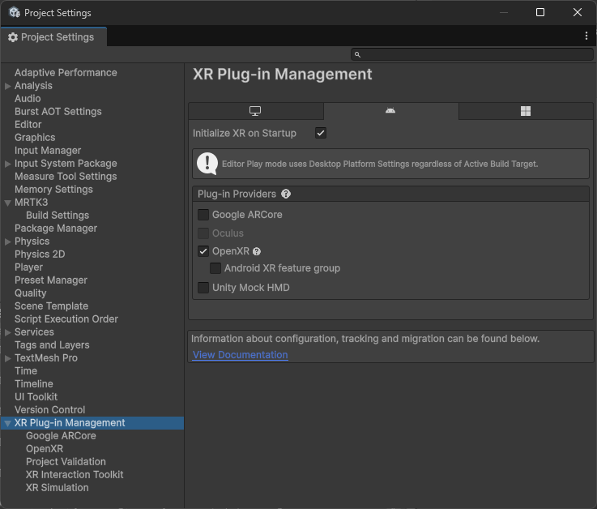

# Deploy to a Quest device

This page describes how to deploy your Unity Project with MRTK3 onto a Quest device.

> [!NOTE]
> We strongly recommend using [Meta Quest Link](https://www.meta.com/quest/) for rapid iteration and testing on Quest Devices, which allows for instant testing on the device without the need for compile + deploy.

## Deployment Prerequisites

These steps are based around OpenXR as your runtime (i.e. XR plugin provider) as we don't recommend using OculusXR due to underlying compatibility issues.

1. Ensure that your project is ready to deploy on the Quest Device by following [these steps](https://developer.oculus.com/documentation/unity/book-unity-gsg/).

1. Ensure that [developer mode](https://developer.oculus.com/documentation/native/android/mobile-device-setup/#enable-developer-mode) is enabled on your device (you may need to [join a developer team](https://developers.meta.com/horizon/documentation/native/android/mobile-device-setup/#joining-or-creating-a-team) first). Installing the Oculus ADB Drivers is optional.

1. Add MRTK to your project and ensure that your [project settings](../getting-started/setting-up/setup-new-project.md#5-configure-openxr-related-settings) are configured correctly to use the OpenXR pipeline and MRTK's feature set. **These features are required to deploy your project onto your Quest device**.

    > [!NOTE]
    > If starting from the [template project](../getting-started/setting-up/setup-template.md), these project settings should already be configured for you.

1. Navigate to **File > Build Settings**.

1. Under **Platform**, select **Android**. Switch the platform to **Android**, and wait for the operation to finish.

1. Navigate to **Edit > Project Settings**.

1. Under **Project Settings**, navigate to **XR Plug-in Management** and enable **OpenXR** under the **Standalone** and **Android** tabs. Ensure that **Initialize XR on Startup** is selected and that no feature groups are enabled, and wait for the operation to finish.

    

    > [!NOTE]
    > A yellow warning icon may appear after checking the **OpenXR** option. Click that icon to open the **OpenXR Project Validation** tool. Click **Fix All** and ignore the interaction profile issue that can't be auto-fixed. The profiles will be added in the step below.

1. Under **Project Settings**, navigate to **XR Plug-in Management > OpenXR > Interaction Profiles** and ensure the following profiles are listed based on the MRTK features you'd like to use:

    | Profile | MRTK |
    |---------|------|
    | Hand Interaction Profile | For articulated hand input |
    | Oculus Touch Controller Profile | For controller input |

1. Under **Project Settings**, navigate to **XR Plug-in Management > OpenXR > OpenXR Feature Groups** and ensure the following features are checked under **All Features** based on the MRTK features you'd like to use:

    | Feature | MRTK |
    |---------|------|
    | Hand Tracking Subsystem | For rendering the articulated hand joints |
    | Meta Quest Support | For general Quest settings, like Android Manifest permissions |
    | Motion Controller Model | For rendering the Touch controller models |

    > [!NOTE]
    > If you don't see **Motion Controller Model** under the **OpenXR Feature Groups** panel, ensure the **Mixed Reality OpenXR Plugin** is imported into your project.

    

    > [!NOTE]
    > You can enable additional features as needed, but in-scene support for them will come from other packages, like AR Foundation.

1. A yellow warning icon or red error icon may appear during this process. Click that icon to open the **OpenXR Project Validation** tool. Select **Fix All** to address the issues. There may be several items to address.

1. If you plan on using the native keyboard, please refer to the [keyboard documentation](../../mrtk3-input/packages/input/System-keyboard.md#meta-quest-specific-setup) for a required `AndroidManifest.xml` modification.

## Using platform controller models

> [!NOTE]
> **Controller models** are stored in a format that is not natively supported by Unity. To use MRTK Controller Visualization on Quest, you will need to make sure you have the following packages in your project:
>
> - [glTFast importer](https://github.com/atteneder/glTFast) which enables the use of glTF asset files in Unity and allows the use of MRTK Controller Visualization on Quest
> - [KTX extension](https://github.com/atteneder/KtxUnity) which allows users to load KTX or Basis Universal texture files
>
> If you started with the MRTK3 template project, these packages have already been included in the project.
> If not, an MRTK project validation rule will help you import the packages.

## Deploying to Device

After you have the project configured, proceed to [generate, deploy, and run a build](https://developers.meta.com/horizon/documentation/unity/unity-build/#generate-deploy-and-run-a-build). We recommend that you select **Build and Run**. This option lets Unity deploy your project directly to your Quest device.
