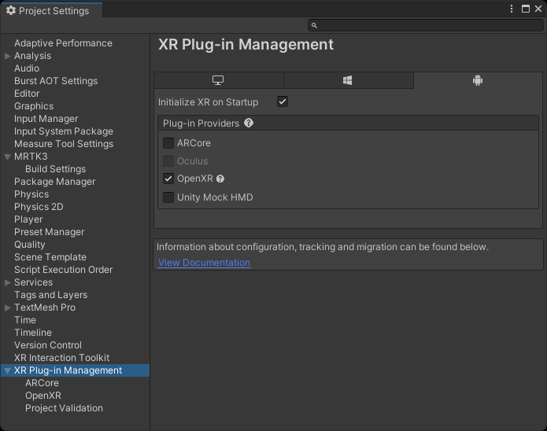
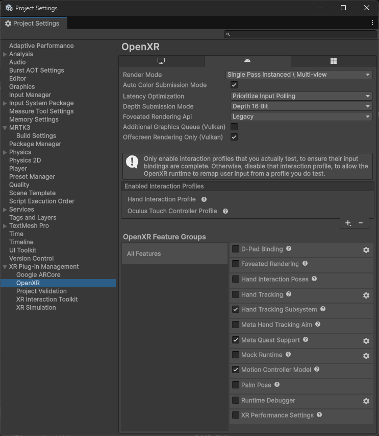

# Deploy an MRTK3 project to a Quest device

This page describes how to deploy your Unity Project with MRTK3 onto a Quest device.

> [!NOTE]
> We strongly recommend using [Meta Quest Link](https://www.meta.com/quest/) for rapid iteration and testing on Quest Devices, which allows for instant testing on the device without the need for compile + deploy.

## Deployment Prerequisites

These steps are based around OpenXR as your runtime (i.e. XR plugin provider) as we don't recommend using OculusXR due to underlying compatibility issues.

1. Ensure that your project is ready to deploy on the Quest Device by following [these steps](https://developer.oculus.com/documentation/unity/book-unity-gsg/).

1. Ensure that [developer mode](https://developer.oculus.com/documentation/native/android/mobile-device-setup/#enable-developer-mode) is enabled on your device (you may need to [join a developer organization](https://developer.oculus.com/documentation/native/android/mobile-device-setup/#joining-or-creating-an-organization) first). Installing the Oculus ADB Drivers is optional.

1. Add MRTK to your project and ensure that your [project settings](../getting-started/setting-up/setup-new-project.md#5-configure-openxr-related-settings) are configured correctly to use the OpenXR pipeline and MRTK's feature set. **These features are required to deploy your project onto your Quest device**. You may ignore project settings instructions regarding the UWP platform.

> [!NOTE]
> If starting from our [template project](../getting-started/setting-up/setup-template.md), these project settings should already be configured for you.

1. Navigate to **File > Build Settings**.

1. Under **Platform**, select **Android**. Switch the platform to **Android**, and wait for the operation to finish.

1. Navigate to **Edit > Project Settings**.

1. Under **Project Settings**, navigate to **XR Plug-in Management** and enable **OpenXR** under the **Android** tab. Ensure that **Initialize XR on Startup** is selected and that no feature groups are enabled, and wait for the operation to finish.

    

1. Under **Project Settings**, navigate to **XR Plug-in Management > OpenXR > Interaction Profiles** and change it so only **Oculus Touch Controller Profile** is present.

1. Under **Project Settings**, navigate to **XR Plug-in Management > OpenXR > OpenXR Feature Groups** and ensure the following are checked under **All Features**.

    > [!NOTE]
    > If you don't see **Hand Tracking** or **Motion Controller Model** under the **OpenXR Feature Groups** panel, please refer to Configure OpenXR-related settings section of [project settings](../getting-started/setting-up/setup-new-project.md#5-configure-openxr-related-settings).

    

1. Navigate to Project Validation, and fix any Red or yellow error/warning icons might appear during this process. Click the icon to open the **OpenXR Project Validation** tool and select **Fix All** to address the issues. There may be several items to address.

1. If you plan on using the native keyboard, please refer to the [keyboard documentation](../../mrtk3-input/packages/input/System-keyboard.md#meta-quest-specific-setup) for a required `AndroidManifest.xml` modification.

## Using platform controller models

> [!NOTE]
> **Controller models** are stored in a format that is not natively supported by Unity. To use MRTK Controller Visualization on Quest you will need to make sure you have the following packages in your project:
>
> - [glTF importer](https://github.com/atteneder/glTFast) which enables the use of glTF asset files in Unity and allows the use of MRTK Controller Visualization on Quest
> - [KTX Package](https://github.com/atteneder/KtxUnity) which allows users to load KTX or Basis Universal texture files
>
> If you started with the MRTK3 template project, these packages have already been included in the project.

## Deploying to Device

> [!NOTE]
> **Do not** follow the Configure Settings instructions on Oculus's documentation page. Their instructions require the use of the Oculus Integration SDK, and uses the Oculus XR plugin rather than the OpenXR plugin.

After you have the project configured, proceed to [Generate Build](https://developer.oculus.com/documentation/unity/unity-build/#generate-build). We recommend that you select **Build and Run**. This option lets Unity deploy your project directly to your Quest device.
