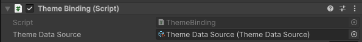
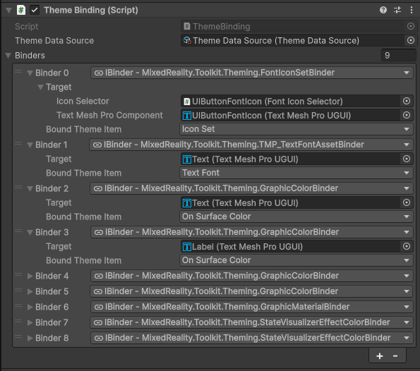

# MRTK UX Theming

## Overview

MRTK Theming 3.0 is a lightweight data-binding system that routes named values from a theme asset to components in the scene. Switching the active theme on a `ThemeDataSource` instantly updates every bound component across all scenes and prefabs that reference it.

The system has three layers:

| Layer | Asset / Component | Purpose |
|---|---|---|
| **Schema** | `ThemeDefinition` (ScriptableObject) | Declares what named items exist and what type each one is |
| **State** | `ThemeDataSource` (ScriptableObject) | The single source of truth for the currently active theme |
| **Values** | `Theme` (ScriptableObject) | Provides a concrete value for every item in the definition |
| **Binding** | `ThemeBinding` (MonoBehaviour) + binders | Connects a theme item to a specific component on a GameObject |

> [!NOTE]
> `ThemeBinding` exists in the UX Core package for cross-package compatibility.

---

## Theme data source

A `ThemeDataSource` ScriptableObject is the single source of truth for which theme is currently active. Create one per logical theme domain (e.g. one for the whole app, or one per scene).


The `ThemeDataSource` holds:

- **`activeTheme`** — the currently applied `Theme` asset.
- **`themeDefinition`** — the `ThemeDefinition` asset (schema) that all compatible themes must conform to.

To switch themes at runtime, assign a new `Theme` to `themeDataSource.value`. Every `ThemeBinding` component subscribed to that source will immediately receive and apply the new values.

### Theme definition

A `ThemeDefinition` ScriptableObject is a list of named items, each with a declared data type. It acts as the contract between the `ThemeDataSource` and all `Theme` assets that reference it — every `Theme` must provide a value for every item in the definition.

Each item has:

- **Name** — a string key used to match binders to values at runtime (e.g. `"Primary Color"`, `"Backplate Material"`).
- **Data type** — a concrete subclass of `BaseThemeItemData<T>` (e.g. `ColorThemeItemData`, `MaterialThemeItemData`).


---

## Theme

A `Theme` ScriptableObject is assigned to a `ThemeDataSource` and provides a concrete value for every item declared in its referenced `ThemeDefinition` schema.


The `Theme` inspector automatically displays one field per definition item, typed correctly. Themes are **complete** — every item in the definition must have a value. This ensures that switching themes always fully overwrites every bound property, with no leftover values from a previous theme.

---

## Theme binding

The `ThemeBinding` MonoBehaviour connects a `ThemeDataSource` to one or more components on the same GameObject (or its children). Add it to any GameObject that should respond to theme changes.



`ThemeBinding` holds:

- **`themeDataSource`** — the source to subscribe to.
- **`binders`** — a list of `IBinder` implementations, each connecting one theme item to one component.

On `OnEnable`, each binder subscribes to the data source and immediately receives the current theme. On `OnDisable`, binders unsubscribe.



### Theme binders

A theme binder connects a named theme item to a specific component property. Each binder has:

- **Target** — the component to update (e.g. a `Graphic`, `Transform`, `Renderer`).
- **Bound Theme Item** — the name of the item in the `ThemeDefinition` to read from.

When the active theme changes, the binder looks up its named item in the new theme and calls `Apply` with the value.

#### Built-in binders

| Binder | Data type | Target | Sets |
|---|---|---|---|
| `GraphicColorBinder` | `Color` | `Graphic` | `Graphic.color` |
| `GraphicMaterialBinder` | `Material` | `Graphic` | `Graphic.material` |
| `RendererMaterialBinder` | `Material` | `Renderer` | `Renderer.material` |
| `TMP_TextFontAssetBinder` | `TMP_FontAsset` | `TMP_Text` | Font asset |
| `ImageSpriteBinder` | `Sprite` | `Image` | `Image.sprite` |
| `SpriteRendererSpriteBinder` | `Sprite` | `SpriteRenderer` | `SpriteRenderer.sprite` |
| `SpriteRendererColorBinder` | `Color` | `SpriteRenderer` | `SpriteRenderer.color` |
| `TransformLocalScaleBinder` | `Vector3` | `Transform` | `Transform.localScale` |
| `LayoutGroupPaddingBinder` | `RectOffset` | `HorizontalOrVerticalLayoutGroup` | Padding |
| `RoundedRectMask2DRadiusBinder` | `float` | `RoundedRectMask2D` | Corner radius |
| `FontIconSetBinder` | `FontIconSetData` | `FontIconSetBinding` | Font + icon set |
| `BehaviourEnabledBinder` | `bool` | `Behaviour` | `Behaviour.enabled` |
| `SkyboxMaterialBinder` | `Material` | `Skybox` | `Skybox.material` |
| `StateVisualizerEffectColorBinder` | `Color` | `StateVisualizer` | Tint effect color per state |

---

## Extending the system

### Creating a new theme item data type

Subclass `BaseThemeItemData<T>` with the desired value type and mark it `[Serializable]`:

```csharp
[Serializable]
public class FloatItemData : BaseThemeItemData<float> { }
```

The new type will automatically appear in the `ThemeDefinition` item type dropdown in the Inspector.

### Creating a new binder

Subclass `BaseThemeBinder<T, K>` where `T` is the value type and `K` is the target component type. Mark it `[Serializable]` and implement `Apply`:

```csharp
[Serializable]
public class MyCustomBinder : BaseThemeBinder<Color, MyComponent>
{
    protected override void Apply(BaseThemeItemData<Color> themeItemData)
    {
        if (Target != null)
        {
            Target.MyColorProperty = themeItemData.Value;
        }
    }
}
```

The new binder will automatically appear in the `ThemeBinding` binder type dropdown in the Inspector, and the **Bound Theme Item** dropdown will show only the definition items whose data type is compatible with `T`.

---

## How theme switching works at runtime

1. `themeDataSource.value = newTheme` is called.
2. `ThemeDataSource` fires a `ChangeEvent<Theme>` to all listeners.
3. Each `ThemeBinding` component's binders receive the event via `OnThemeChanged`.
4. Each binder calls `Theme.TryGetItemData(ThemeDefinitionItemName, ...)` to look up its value.
5. If found, `Apply` is called with the new value. If not found, a warning is logged.

Because themes are complete (every definition item has a value in every theme), every bound property is always overwritten on a theme switch — there are no partial updates or leftover values from a previous theme.
